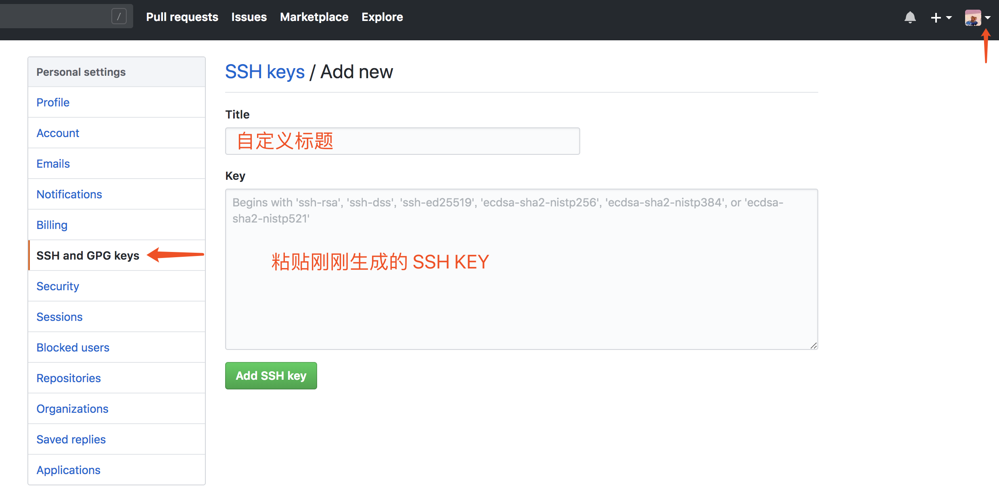

<!-- START doctoc generated TOC please keep comment here to allow auto update -->
<!-- DON'T EDIT THIS SECTION, INSTEAD RE-RUN doctoc TO UPDATE -->
**Table of Contents**  *generated with [DocToc](https://github.com/thlorenz/doctoc)*

- [1. Git 基本概念解释](#1-git-%e5%9f%ba%e6%9c%ac%e6%a6%82%e5%bf%b5%e8%a7%a3%e9%87%8a)
- [2. Git 使用](#2-git-%e4%bd%bf%e7%94%a8)
	- [2.1. 使用SSH(密钥)访问Github](#21-%e4%bd%bf%e7%94%a8ssh%e5%af%86%e9%92%a5%e8%ae%bf%e9%97%aegithub)
	- [2.2. 创建远程仓库（在`Github`网站上创建）](#22-%e5%88%9b%e5%bb%ba%e8%bf%9c%e7%a8%8b%e4%bb%93%e5%ba%93%e5%9c%a8github%e7%bd%91%e7%ab%99%e4%b8%8a%e5%88%9b%e5%bb%ba)
	- [2.3. 从远程仓库克隆代码](#23-%e4%bb%8e%e8%bf%9c%e7%a8%8b%e4%bb%93%e5%ba%93%e5%85%8b%e9%9a%86%e4%bb%a3%e7%a0%81)
	- [2.4. 本地项目关联远程仓库（假设项目名称是 test-project）](#24-%e6%9c%ac%e5%9c%b0%e9%a1%b9%e7%9b%ae%e5%85%b3%e8%81%94%e8%bf%9c%e7%a8%8b%e4%bb%93%e5%ba%93%e5%81%87%e8%ae%be%e9%a1%b9%e7%9b%ae%e5%90%8d%e7%a7%b0%e6%98%af-test-project)
	- [2.5. 从远程仓库获取最新版本的代码到本地（三种方法: 以 test 分支为例）](#25-%e4%bb%8e%e8%bf%9c%e7%a8%8b%e4%bb%93%e5%ba%93%e8%8e%b7%e5%8f%96%e6%9c%80%e6%96%b0%e7%89%88%e6%9c%ac%e7%9a%84%e4%bb%a3%e7%a0%81%e5%88%b0%e6%9c%ac%e5%9c%b0%e4%b8%89%e7%a7%8d%e6%96%b9%e6%b3%95-%e4%bb%a5-test-%e5%88%86%e6%94%af%e4%b8%ba%e4%be%8b)
	- [2.6. 文件操作(以 readme.md 文件为例)](#26-%e6%96%87%e4%bb%b6%e6%93%8d%e4%bd%9c%e4%bb%a5-readmemd-%e6%96%87%e4%bb%b6%e4%b8%ba%e4%be%8b)
	- [2.7. 分支操作(以分支名称为 test 为例)](#27-%e5%88%86%e6%94%af%e6%93%8d%e4%bd%9c%e4%bb%a5%e5%88%86%e6%94%af%e5%90%8d%e7%a7%b0%e4%b8%ba-test-%e4%b8%ba%e4%be%8b)
	- [2.8. 解决冲突](#28-%e8%a7%a3%e5%86%b3%e5%86%b2%e7%aa%81)
	- [2.9. 版本回退](#29-%e7%89%88%e6%9c%ac%e5%9b%9e%e9%80%80)
	- [2.10. 重写历史（修改 commit 注释）](#210-%e9%87%8d%e5%86%99%e5%8e%86%e5%8f%b2%e4%bf%ae%e6%94%b9-commit-%e6%b3%a8%e9%87%8a)
	- [2.11. 撤销 commit](#211-%e6%92%a4%e9%94%80-commit)
	- [2.12. git reflog 时光穿梭机(使用场景: 强制回滚导致丢失一些提交)](#212-git-reflog-%e6%97%b6%e5%85%89%e7%a9%bf%e6%a2%ad%e6%9c%ba%e4%bd%bf%e7%94%a8%e5%9c%ba%e6%99%af-%e5%bc%ba%e5%88%b6%e5%9b%9e%e6%bb%9a%e5%af%bc%e8%87%b4%e4%b8%a2%e5%a4%b1%e4%b8%80%e4%ba%9b%e6%8f%90%e4%ba%a4)
	- [2.13. 找回 git 中只 add,未 commit 的代码](#213-%e6%89%be%e5%9b%9e-git-%e4%b8%ad%e5%8f%aa-add%e6%9c%aa-commit-%e7%9a%84%e4%bb%a3%e7%a0%81)
	- [2.14. Tag 标签操作](#214-tag-%e6%a0%87%e7%ad%be%e6%93%8d%e4%bd%9c)
	- [2.15. 合并分支上指定的 commit: Cherry-Pick](#215-%e5%90%88%e5%b9%b6%e5%88%86%e6%94%af%e4%b8%8a%e6%8c%87%e5%ae%9a%e7%9a%84-commit-cherry-pick)
- [3. gitignore](#3-gitignore)
- [4. 错误处理](#4-%e9%94%99%e8%af%af%e5%a4%84%e7%90%86)
	- [4.1. 从报错上来说，貌似是因为提交的文件过大造成的错误；尝试修改一下postBuffer的参数：git config –global http.postBuffer 52428800](#41-%e4%bb%8e%e6%8a%a5%e9%94%99%e4%b8%8a%e6%9d%a5%e8%af%b4%e8%b2%8c%e4%bc%bc%e6%98%af%e5%9b%a0%e4%b8%ba%e6%8f%90%e4%ba%a4%e7%9a%84%e6%96%87%e4%bb%b6%e8%bf%87%e5%a4%a7%e9%80%a0%e6%88%90%e7%9a%84%e9%94%99%e8%af%af%e5%b0%9d%e8%af%95%e4%bf%ae%e6%94%b9%e4%b8%80%e4%b8%8bpostbuffer%e7%9a%84%e5%8f%82%e6%95%b0git-config-%e2%80%93global-httppostbuffer-52428800)
	- [4.2. git push代码遇到:fatal: refusing to merge unrelated histories](#42-git-push%e4%bb%a3%e7%a0%81%e9%81%87%e5%88%b0fatal-refusing-to-merge-unrelated-histories)
	- [4.3. windows 使用 git 会有警告： LF will be replaced by CRLF in package.json. the file will have its original line endings in your working directory](#43-windows-%e4%bd%bf%e7%94%a8-git-%e4%bc%9a%e6%9c%89%e8%ad%a6%e5%91%8a-lf-will-be-replaced-by-crlf-in-packagejson-the-file-will-have-its-original-line-endings-in-your-working-directory)
	- [4.4. git切换分支的时候报：The following untracked working tree files would be overwritten by checkout](#44-git%e5%88%87%e6%8d%a2%e5%88%86%e6%94%af%e7%9a%84%e6%97%b6%e5%80%99%e6%8a%a5the-following-untracked-working-tree-files-would-be-overwritten-by-checkout)

<!-- END doctoc generated TOC please keep comment here to allow auto update -->

[一个有意思的 Git 学习小游戏](https://learngitbranching.js.org/)

# 1. Git 基本概念解释

+ [git 官网](https://git-scm.com/book/zh/v1/)
+ [git - 简易指南](http://www.bootcss.com/p/git-guide/)

> 工作区：就是电脑上的目录，比如testGit（.git隐藏目录版本库除外）。

> 版本库（Repository）：.git就是版本库，里面存了很多东西，其中最重要的就是stage（暂存区），还有Git为我们自动创建的第一个分支master，以及指向master的一个指针HEAD。

> HEAD 严格来说不是指向提交，而是指向 master，master才是指向提交的。所以 HEAD 指向的就是当前分支。

# 2. Git 使用

## 2.1. 使用SSH(密钥)访问Github

- Windows

	1. 创建 SSH KEY，一个 github 账号配置一次就好

        ```
        git config --global user.name "你的 github 用户名"
		git config --global user.email "你的 github 邮箱"
        ```

	2. 设置好后会在计算机的 `C:\Users\Administrator\.ssh` 这个目录生成两个文件，用带有后缀 .pub 的

	3. 登录GitHub系统: 点击右上角账号头像的“▼” -> Settings -> SSH and GPG kyes -> Add SSH key -> 填id_rsa.pub文件的内容

	

- Mac

	之前用 Windows 的时候配置的，网上找一篇 Mac 上配的教程：[Mac下使用SSH(密钥)访问Github](https://www.cnblogs.com/peteremperor/p/6135809.html)

设置好 SSH 后就可以在 GitHub 上创建项目仓库，按照下面内容可以将本地项目与 GitHub 上的关联起来。

## 2.2. 创建远程仓库（在`Github`网站上创建）

点 Github 右上角➕， New repository 输入名称创建即可。

## 2.3. 从远程仓库克隆代码

```
git clone "远程仓库地址"
```

克隆好后本地会有一个跟远程仓库一样名字的文件夹，这个文件夹就是我们的本地仓库，跟远程仓库是关联的，默认在 `master` 分支上提交代码。添加其他分支需要手动关联一下，这个接下来会讲。

另一种将本地仓库与远程仓库关联起来的方法是，先在本地创建一个仓库，再手动与远程仓库关联，见 四。

## 2.4. 本地项目关联远程仓库（假设项目名称是 test-project）

1. 在 github 中新建项目 test-project
2. 在本地项目 test-project 目录下初始化本地仓库：

	```
	git init
	```

3. 在本地项目建立.gitignore README.md文件
4. 本地提交：

	```
	git add .
	git commit -m "first commit"
	```

5. 添加远程关联（在github中新建项目之后会有个地址：git@ 开头的或 https 开头的）：

	```
	git remote add origin "远程仓库地址"
	```

6. 本地分支与远程分支关联，并推送到远程仓库：

	```
	git push --set-upstream origin master
	```

	或者（第一次关联好了以后就可以直接用 git push 提交）

	```
	git push -u origin master
	```

## 2.5. 从远程仓库获取最新版本的代码到本地（三种方法: 以 test 分支为例）

1. 第一种:
	1. 查看远程库信息(远程库的默认名称是 `origin`, 加 `-v` 查看远程库的详细信息):

		```
		git remote -v
		```

	2. 拉取远程 `origin/test` 分支到本地
   (`git fecth` 相当于是从远程获取最新版本到本地，不会自动 `merge`):

		```
		git fetch origin test
		```

	3. 比较本地的 `test` 分支和 `origin/test `分支的差别:

		```
		git log -p test..origin/test
		```

	4. 合并`origin/test`到当前分支:

		```
		git merge origin/test
		```

2. 第二种:
	5. 从远程获取最新的版本到本地分支上:

		```
		git fetch origin test: test
		```

	6. 之后再进行比较合并:

		```
		git diff test
		git merge test
		```

3. 第三种:

	`git pull` 相当于是从远程获取最新版本并merge到本地:

	```
	git pull origin master
	```

## 2.6. 文件操作(以 readme.md 文件为例)

把文件提交到暂存区(`.` 是提交所有文件到暂存区):

```
git add readme.md(或 .)
```

把文件提交到分支上(即提交到本地仓库):

```
git commit -m "first commit"
```

查看分支状态:

```
git status
```

查看修改了什么内容:

```
git diff readme.md
```

撤销修改:  `git ad readme.md`后想要放弃修改则执行该条命令(`.` 是撤销所有修改, 但是添加/删除文件撤销不了)

```
git checkout -- readme.md(或 .)
```

删除文件夹:

```
git rm -rf 文件夹名
git add -A
git commit -m "delete dir"
git push
```

`git add -A` 和 `git add .` 的区别:

[git add -A 和 git add . 的区别](https://www.cnblogs.com/skura23/p/5859243.html)(Git version 1.x)

[git add all和git add .区别](http://www.softwhy.com/article-8489-1.html)

[Difference between “git add -A” and “git add .”](https://stackoverflow.com/questions/572549/difference-between-git-add-a-and-git-add)

`git rm` 与 `git rm --cached` 的区别:

[git rm与git rm --cached](https://www.jianshu.com/p/337aeafc2f40)

## 2.7. 分支操作(以分支名称为 test 为例)

查看所有分支:

```
git branch -a
```

查看远程分支:

```
git branch -l
```

查看本地分支:

```
git branch
```

创建分支:

```
git branch test
```

切换分支:

```
git checkout test
```

强制切换分支:

```
git checkout -f test
```

创建分支并切换到该分支:

```
git checkout -b test
```

删除分支:

```
git branch -d test
```

强制删除分支:

```
git branch -D test
```

删除远程分支:

```
git push origin :test
```

刷新远程分支:

```
git fetch
```

拉取远程仓库的某个分支:

```
git fetch origin master
```

拉取所在分支上所有代码:

```
git pull
```

把本地分支推到远程:

```
git push origin test
```

推送本地分支到远程(与远程分支名称不一样):

```
// 第一种, 推送本地分支到远程 master 分支
git push origin HEAD:master

// 第二种, 推送本地 test 分支到远程 develop 分支
git push origin test:develop
```

合并指定分支到当前分支(合并 test 分支到当前分支):

```
git merge test
```

## 2.8. 解决冲突

> 通常合并分支时，git一般使用”Fast forward”模式，在这种模式下，删除分支后，会丢掉分支信息，现在我们来使用带参数 –no-ff 来禁用”Fast forward”模式。

>> 合并dev分支，使用命令 git merge –no-ff  -m “注释” dev

> 分支策略：首先master主分支应该是非常稳定的，也就是用来发布新版本，一般情况下不允许在上面干活，干活一般情况下在新建的dev分支上干活，干完后，比如上要发布，或者说dev分支代码稳定后可以合并到主分支master上来。

	1. master		// 合并其他分支，发布新版本
	2. dev			// 开发，干活
	3. bug			// 临时分支，修复 bug	eg:issue-404

> 在开发中，会经常碰到bug问题，那么有了bug就需要修复，在Git中，分支是很强大的，每个bug都可以通过一个临时分支来修复，修复完成后，合并分支，然后将临时的分支删除掉。

将当前工作现场隐藏起来
```
git stash
```

查看被隐藏的工作现场

```
git stash list
```

恢复工作现场

```
git stash apply
```
或

```
git stash pop
```

使用 `git stash apply` 恢复后，stash 内容并不删除，需要使用命令来删除
```
git stash drop stash@{0}
```

使用 `git stash pop` 恢复的同时也把 stash 内容也删除了

## 2.9. 版本回退

显示从最近到最远的日志(获取版本号):

```
git log

// 格式美化
git log --pretty=oneline
```

回退到上一个版本:
```
git reset --hard HEAD^
```

回退到上两个版本，以此类推:

```
git reset --hard HEAD^^
```

回退到前100个版本:

```
git reset --hard HEAD~100
```

恢复到指定版本[version]是版本号:

```
git reset --hard [version]
```

## 2.10. 重写历史（修改 commit 注释）

重写历史(修改 `commit`):

```
git commit --amend
```

## 2.11. 撤销 commit

```
git reset --soft HEAD^
```

`HEAD^` 的意思是上一个版本，也可以写成 `HEAD~1`

```
git reset --soft HEAD~1
```

如果你进行了2次 `commit`，想都撤回，可以使用 `HEAD~2`

```
git reset --soft HEAD~2
```

参数：

- `--mixed`: 不删除工作空间改动代码，撤销 `commit`，并且撤销 `git add` 操作。

	这个为默认参数，以下两行代码效果是一样的。
	```
	git reset --mixed HEAD^
	git reset HEAD^
	```

- `--soft`: 不删除工作空间改动代码，撤销 `commit`，不撤销 `git add`。

- `--hard`: 删除工作空间改动代码，撤销 `commit`，撤销 `git add`。**注意**完成这个操作后，就恢复到了上一次的 `commit` 状态。

## 2.12. git reflog 时光穿梭机(使用场景: 强制回滚导致丢失一些提交)

展示所有之前 git 操作:

```
git reflog
```

回滚到某次提交:

```
git reset --hard [verson1]
```

把 verson2 的这次提交也合到分支上来:

```
git cherry-pick [verson2]
```


## 2.13. 找回 git 中只 add,未 commit 的代码

代码 `git add` 后(但是未 `git commit`)切换分支, 一顿操作之后发现 `git add` 的代码不见了(///▽///)

如果编辑器有本地历史记录可以找到恢复下, 如果没有可以尝试使用以下命令找回:

```
git fsck --lost-found
```
执行命令后到 `.git/lost-found` 目录下找找看有没有丢失的文件, 如果没有那就是没有了

## 2.14. Tag 标签操作

1. 打包

	```
	npm run build
	```

2. 打 tag

	```
	git tag [tagName]
	```

3. push tag

	```
	git push origin [tagName]
	```

4. 查看已有 tag

	```
	git tag
	```

5. 查看远程所有 tag

	```
	git ls-remote --tags origin
	```

6. 删除 tag

	```
	git tag -d [tagName]
	```

## 2.15. 合并分支上指定的 commit: Cherry-Pick

[Cherry-Pick | 一日一 Git](https://juejin.im/post/5925a2d9a22b9d0058b0fd9b)

```js
// 当执行完 cherry-pick 之后，将会自动生成一个新的 commit 进行提交，也就是会有一个新的 commit ID。
git cherry-pick <commit-id>

// 保留原提交的作者信息进行提交
git cherry-pick -x <commit_id>

// 这是一个 (左开，右闭] 的区间，也就是说，它将不会包含 start-commit-id 的 commit。eg: git cherry-pick 371c2…971209 // (2,5]
git cherry_pick <start-commit-id>...<end-commit-id>

// 如果想要包含 start-commit-id 的话，就需要使用 ^ 标记一下，就会变成一个 [左闭，右闭] 的区间，具体命令如下。eg: git cherry-pick 371c2^…971209 // [2,5]
git cherry-pick <start-commit-id>^...<end-commit-id>
```

> 如果顺利的话，就可以正常提交了。如果遇到冲突，使用 git diff 解决冲突即可，工作中，不推荐手工解决冲突，最好还是使用一些 diff 工具来处理，毕竟手工处理容易出错。

如果 `cherry-pick` 没有合并成功，比如出现冲突：

- 如果想解决完冲突后继续合并，那么解决完冲突后运行

	```js
	git cherry-pick --continue
	```

- 如果想取消 `cherry-pick` 操作

	```js
	git cherry-pick --abort
	```

--------------------------------------------------------------------------------

# 3. gitignore

[Git忽略提交规则 - .gitignore配置运维总结](https://www.cnblogs.com/kevingrace/p/5690241.html)

# 4. 错误处理

## 4.1. [从报错上来说，貌似是因为提交的文件过大造成的错误；尝试修改一下postBuffer的参数：git config –global http.postBuffer 52428800](https://segmentfault.com/q/1010000002940878)

	Counting objects: 64, done.
	Delta compression using up to 4 threads.
	Compressing objects: 100% (43/43), done.
	error: RPC failed; curl 56 OpenSSL SSL_read: SSL_ERROR_SYSCALL, errno 10054
	e remote end hung up unexpectedly3/64), 10.79 MiB | 4.00 KiB/s
	Writing objects: 100% (64/64), 106.01 MiB | 160.00 KiB/s, done.
	Total 64 (delta 16), reused 49 (delta 10)
	fatal: The remote end hung up unexpectedly

	解决办法（设置缓存）：`git config http.postBuffer 524288000`

## 4.2. [git push代码遇到:fatal: refusing to merge unrelated histories](https://www.jianshu.com/p/afe505fa0b33)

这种错误一般出现在首次上传代码时. 远程分支和本地分支不一样,
远程(origin)有 README.md 文件 , 但是本地仓库没有;
你想push 他提示你先 pull 一下. 你pull 一下,MD他又提示你 :fatal: refusing to merge unrelated histories

	温柔：

	git log -p master..origin/master		// 查看本地master分支和远程(origin)分支的区别
	git pull --rebase origin master			// 这段命令,会在本地生成一个README.md文件并将 远端代码pull 下来.
	git push -u origin master 			// 上传代码

	简单粗暴：

	git pull origin master --allow-unrelated-histories		// 不推荐

## 4.3. [windows 使用 git 会有警告： LF will be replaced by CRLF in package.json. the file will have its original line endings in your working directory](http://blog.csdn.net/feng88724/article/details/11600375)

	warning: LF will be replaced by CRLF in package.json.
	The file will have its original line endings in your working directory

这是因为 windows 和 linux 中换行符不同。 windows中的换行符为 CRLF， 而在Linux下的换行符为LF

	解决：

	git config core.autocrlf false

## 4.4. [git切换分支的时候报：The following untracked working tree files would be overwritten by checkout](https://www.centos.bz/2018/03/git%e5%88%87%e6%8d%a2%e5%88%86%e6%94%af%e6%8f%90%e7%a4%ba%e5%a4%b1%e8%b4%a5%ef%bc%88the-following-untracked-working-tree-files-would-be-overwritten-by-checkout%ef%bc%89/)

	解决:

	1. git rm –cached
	2. 
      1. git clean -n
      2. git clean -d -fx .(运行这条命令之前最好运行下上一条, 这样可以知道将要删除哪些文件和目录)

	参数:

	-n 显示将要删除的文件和目录
	-x means ignored files are also removed as well as files unknown to git.
	-d means remove untracked directories in addition to untracked files.
	-f is required to force it to run.

	如果以上方法不行, 可以强制切换下分支:

	git checkout test -f
